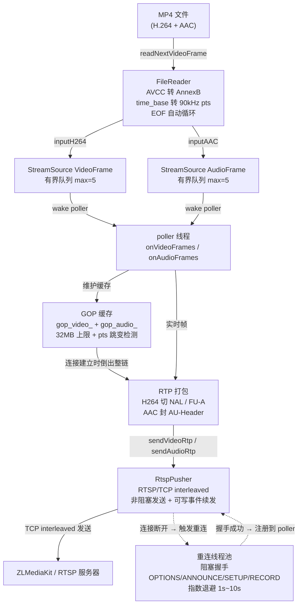

# ffmpeg_push

基于 FFmpeg 库的多路 RTSP/RTP 推流系统：以固定线程数（约 10 个线程）支撑数百路流，将 H.264 + AAC 推送到 **ZLMediaKit** 等 RTSP 服务器，支持 GOP 缓存、断线重连与 1:N 广播。

## 特性

- **多路推流**：默认 4 个读线程 + 4 个 poller 线程即可驱动数百路流，线程数与流数无关
- **音视频同步推流**：H.264（AnnexB）+ AAC 双轨，RTP 90kHz 时间戳体系
- **滚动 GOP 缓存**：连接建立时立即倒出从最近 IDR 起的完整参考链，避免 ZLMediaKit 轨道超时导致的音频丢弃与马赛克
- **断线重连**：阻塞握手在独立重连线程池中执行，指数退避重试（1s~10s）
- **1:N 广播**：一路 MediaSource 可同时推送到多个 RTSP 地址
- **源无关设计**：MP4 文件读取与摄像头采集回调共用同一条处理链（`inputH264` / `inputAAC` 为唯一输入入口）

## 架构与数据流



### 帧流向（从左到右）

1. **ReaderPool**（SchedulePool 读线程）按文件帧率节奏调度，每路流一个周期任务：读一帧视频（含沿途音频）→ 推入 MediaSource → 返回帧间隔微秒数
2. **FileReader** 负责解封装：AVCC 转 AnnexB、时间基转 RTP 90kHz pts、EOF 时带 pts 偏移循环
3. **MediaSource** 每路流一个，`inputH264` / `inputAAC` 任意线程可调用，帧进入 `StreamSource` 有界队列（max=5，约 200ms 积压）后唤醒绑定的 poller 线程
4. **poller 线程** 消费队列：维护 GOP 缓存 → RTP 打包 → 交给各 Session 的 RtspPusher 非阻塞发送
5. **RtspPusher** 以 TCP interleaved（`$` + channel + len 封帧）发送；`recv()==0` 判定对端断开，由重连线程池阻塞重握手

### 线程分工（固定线程数，与流数无关）

| 线程池 | 默认数 | 职责 |
|---|---|---|
| SchedulePool（读线程） | 4 | 按帧率节奏读取 MP4，跨线程投递帧 |
| EventPollerPool（poller） | 4 | 消费帧队列、GOP 缓存维护、RTP 打包、非阻塞发送，单线程服务数百路流 |
| ThreadPool（重连） | 4 | 阻塞 RTSP 握手与重连，避免慢服务器饿死其他流的连接 |

## GOP 缓存机制

针对推流到 ZLMediaKit 时 GOP 过长导致的问题：播放器连接后等待下一个 I 帧期间触发轨道超时，进而丢弃音频。

- MediaSource 维护 `gop_video_` / `gop_audio_` 双缓冲：从最近 IDR 起保存完整视频帧链及对齐的音频帧
- 会话连接建立时（`pending_key`）一次性倒出缓存 GOP，随后无缝衔接实时帧
- 相比仅缓存单帧：参考链完整，不会出现解码马赛克；相比等待整个 GOP：不会触发 track 超时
- 保护机制：32MB 字节上限、pts 跳变检测（队列溢出）、`stop()` 时清理缓存
- 缓存维护全部在 poller 线程内完成，无跨线程并发问题

## 依赖

| 组件 | 版本 |
|---|---|
| FFmpeg | n8.x（libavcodec 62 / libavformat 62 / libavutil 60 / libswresample 6 / libswscale 9） |
| 编译工具链 | Visual Studio 2022（Windows，x64） |
| 接收端（可选） | ZLMediaKit 等标准 RTSP 服务器 |

仓库内 `include/` 与 `lib/` 已包含 FFmpeg n8.x 头文件与导入库，运行依赖的 DLL（`avcodec-62.dll` 等）位于 `x64/Debug/`。

## 构建（Windows）

1. 使用 Visual Studio 2022 打开 `ffmpeg_push.sln`
2. 平台选择 **x64**，配置 **Debug**
3. 直接生成；输出 `x64/Debug/ffmpeg_push.exe`
4. 运行时需保证 FFmpeg DLL（`avcodec-62.dll`、`avformat-62.dll`、`avutil-60.dll`、`avfilter-11.dll`、`avdevice-62.dll`、`swresample-6.dll`、`swscale-9.dll`）与 exe 同目录

## 快速开始

```powershell
ffmpeg_push.exe <file> <host> <port> <stream_count>
```

| 参数 | 说明 | 默认值 |
|---|---|---|
| file | 要循环推送的 MP4 文件 | `F:\test1.mp4` |
| host | RTSP 服务器地址 | `192.168.2.128` |
| port | RTSP 端口 | `10101` |
| stream_count | 并发推流路数 | `1` |

推流地址形如 `rtsp://<host>:<port>/live/stream_0`，可用 ZLMediaKit / VLC 拉流验证。日志输出到 `log/`（64MB 轮转）。

### 摄像头源接入

采集回调中直接调用同一输入入口即可复用整条处理链（无需 ReaderPool）：

```cpp
auto cam = mgr.createMedia("live", "camera_1");
cam->setMediaInfo(/* sps/pps/width/height/aac_extra/... */);
mgr.startSendRtsp(cam, "rtsp://.../live/camera_1");
// 采集线程内：
cam->inputH264(data, len, PtsUtil::wallClockTo90k(t0), is_key);
cam->inputAAC(aac, len, PtsUtil::wallClockTo90k(t0));
```

## 目录结构

```
ffmpeg_push/
├── ffmpeg_push.cpp      # 入口：多路 MP4 循环推流示例
├── media_manager.*      # 门面：createMedia / bindFile / startSendRtsp
├── media_source.*       # 每路流核心：输入入口、GOP 缓存、会话管理
├── reader_pool.*        # SchedulePool 上的 MP4 读取调度
├── file_reader.*        # MP4 解封装：AVCC→AnnexB、pts 转换、循环
├── frame_source.h       # VideoFrame / AudioFrame / MediaInfo 帧契约
├── rtp_packer.*         # H.264 切包（NAL/FU-A）
├── aac_rtp_packer.*     # AAC AU-Header 封装
├── rtsp_pusher.*        # RTSP/TCP interleaved 非阻塞推送
└── kit/                 # 自研基础库
    ├── event_poller.*   # EventPoller 线程池（poller）
    ├── schedule_pool.*  # 定时调度线程池（读线程）
    ├── thread_pool.*    # 重连线程池
    ├── stream_source.h  # 有界队列跨线程传递
    ├── logger.*         # 日志（文件轮转）
    └── ...
```

## 许可

本项目代码基于 FFmpeg 库开发；FFmpeg 采用 LGPL/GPL 双许可，请按实际使用方式遵守其许可条款。
